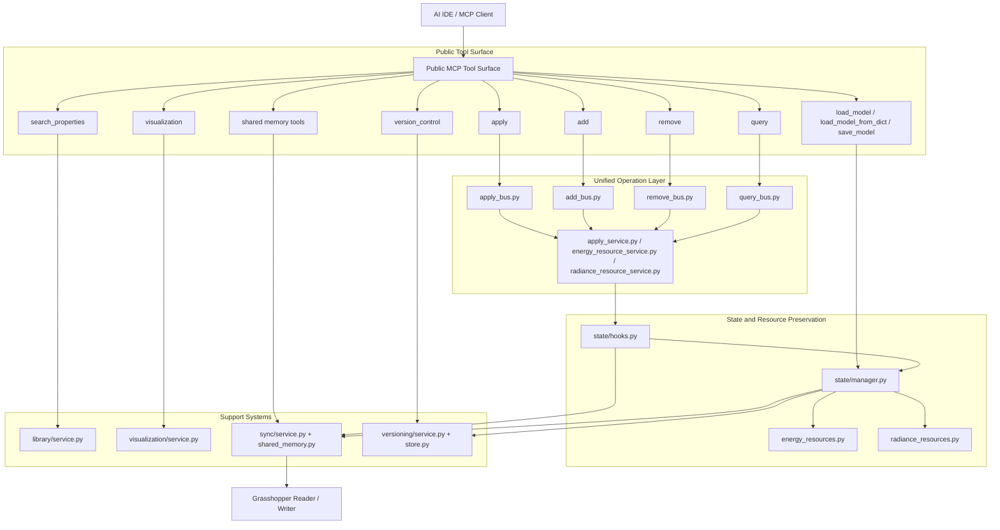
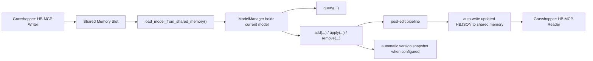

# Honeybee-MCP


Honeybee-MCP is a local `Model Context Protocol` (MCP) server for the Honeybee ecosystem. It is designed to let an AI IDE load, inspect, edit, synchronize, visualize, and version Honeybee models through a stable tool surface instead of a growing collection of one-off scripts. The current implementation supports `honeybee-core`, `honeybee-energy`, `honeybee-radiance`, and bidirectional collaboration with Grasshopper through shared memory.

The project has already moved beyond the older pattern of scattered object-specific tools. Its current architecture is centered on a unified bus model: `query`, `apply`, `add`, and `remove` are the primary editing interfaces, while state management, resource preservation, shared-memory synchronization, visualization export, library search, and version history are handled by dedicated support layers. In practice, this means the server is no longer limited to editing host objects such as rooms, faces, and apertures. It also manages reusable HBJSON-native Energy and Radiance resources so that schedules, modifiers, modifier sets, sensor grids, and views can survive save, reload, version restore, and Grasshopper sync.

> **Note**
> Honeybee-MCP is currently intended for local deployment. It assumes that the model files, the Python environment, the AI IDE, and any Grasshopper shared-memory exchange all run on the same machine or in a directly accessible local environment.

## Contents

1. [What This Project Does](#what-this-project-does)
2. [Architecture Overview](#architecture-overview)
3. [Tool Architecture Diagram](#tool-architecture-diagram)
4. [Repository Structure](#repository-structure)
5. [Public MCP Tools](#public-mcp-tools)
6. [Installation and Startup](#installation-and-startup)
7. [MCP Client Configuration](#mcp-client-configuration)
8. [Recommended Workflows](#recommended-workflows)
9. [Grasshopper Collaboration Flow](#grasshopper-collaboration-flow)
10. [Usage Examples](#usage-examples)
11. [Visualization Exports](#visualization-exports)
12. [Resource Search and Safe Removal](#resource-search-and-safe-removal)
13. [Version Control and Persistence](#version-control-and-persistence)
14. [Documentation Entry Points](#documentation-entry-points)

## What This Project Does

Honeybee-MCP gives an AI agent a stable working interface for Honeybee models. A typical session begins by loading a model from disk, a Python dictionary, or Grasshopper shared memory. The agent can then query model objects, create new geometry-related objects, apply Energy or Radiance attributes, remove geometry or reusable resources, verify the result, visualize the current state, and save or synchronize the model. All of those actions pass through a small set of consistent MCP tools.

This design matters because Honeybee workflows frequently cross the boundary between geometry, simulation properties, and reusable libraries. A model-editing server is only partially useful if it can assign a schedule or modifier in memory but cannot preserve that object through `HBJSON`, reload it later, or restore it from version history. Honeybee-MCP treats persistence as part of feature support. A capability is considered complete only when it participates correctly in load, query, edit, save, reload, shared-memory sync, and version recovery.

## Architecture Overview

The current codebase is organized around a layered architecture.

The first layer is the **state layer**, centered on `tools/state/manager.py`. It owns the currently loaded model, remembers where that model came from, and provides a serialization path that merges managed Energy and Radiance resources back into the HBJSON dictionary. The state layer also hosts post-edit hooks so that editing tools do not need to implement their own shared-memory or auto-save logic.

The second layer is the **operation layer**, centered on `tools/operations`. This is where the unified buses live. `query` reads model or resource data. `apply` updates properties or resource definitions. `add` creates new geometry-related objects, Energy resources, or Radiance resources. `remove` deletes objects while enforcing safety checks for reusable resources that may still be referenced elsewhere.

The third layer is the **support layer**, which includes `tools/sync`, `tools/library`, `tools/visualization`, and `tools/versioning`. These modules handle Grasshopper shared memory, library lookups for standards or resource search, read-only visualization exports, and version snapshots with undo and redo behavior.

The fourth layer is the **client collaboration layer**, which is how AI IDEs and Grasshopper components actually use the server. An MCP client invokes the public tools. Grasshopper can write a model into shared memory, let the AI edit it, and then read the updated model back after the shared-memory post-edit pipeline has written the new HBJSON payload.

## Tool Architecture Diagram

The following diagram shows the main architectural relationship between the public tools and the internal layers that support them.



This diagram highlights the most important rule for future extension work: new capabilities should usually be registered inside the existing buses or support systems rather than added as new top-level object-specific tools. If a feature is fundamentally a query, an update, an addition, a deletion, a shared-memory action, a visualization export, or a versioning action, it should extend the corresponding subsystem directly.

## Repository Structure

The current repository layout is intentionally aligned with the refactored architecture.

```text
Honeybee-MCP/
|-- server.py
|-- requirements.txt
|-- README.md
|-- AGENTS.md
|-- tools/
|   |-- __init__.py
|   |-- mcp_context.py
|   |-- load_model.py
|   |-- save_model.py
|   |-- state/
|   |   |-- manager.py
|   |   |-- hooks.py
|   |   |-- summary.py
|   |   |-- energy_resources.py
|   |   `-- radiance_resources.py
|   |-- operations/
|   |   |-- common.py
|   |   |-- query_bus.py
|   |   |-- apply_bus.py
|   |   |-- add_bus.py
|   |   |-- remove_bus.py
|   |   |-- apply_service.py
|   |   |-- add_service.py
|   |   |-- remove_service.py
|   |   |-- energy_resource_service.py
|   |   |-- radiance_resource_service.py
|   |   `-- hvac_config.json
|   |-- sync/
|   |   |-- bus.py
|   |   |-- service.py
|   |   `-- shared_memory.py
|   |-- library/
|   |   |-- bus.py
|   |   `-- service.py
|   |-- visualization/
|   |   |-- bus.py
|   |   `-- service.py
|   `-- versioning/
|       |-- bus.py
|       |-- service.py
|       `-- store.py
|-- grasshopper/
|   |-- src/
|   |   |-- HB-MCP Reader.py
|   |   `-- HB-MCP Writer.py
|   `-- test/
|-- agent/
|   `-- skills/
`-- src/
```

## Public MCP Tools

The recommended public interface is intentionally compact. Each tool has a clear responsibility.

### Model I/O

- `load_model`
- `load_model_from_dict`
- `save_model`

These tools are used when the source of truth is a file path or a Python dictionary rather than Grasshopper shared memory.

### Shared-memory collaboration

- `load_model_from_shared_memory`
- `save_model_to_shared_memory`
- `check_shared_memory_status`
- `clear_shared_memory_model`
- `cleanup_shared_memory_cache`

These tools support bidirectional exchange between Grasshopper and the MCP server.

### Unified edit surface

- `query`
- `apply`
- `add`
- `remove`

These four tools are the primary authoring interface and should be treated as the default way to inspect and edit the model.

### Support tools

- `search_properties`
- `visualization`
- `version_control`

These tools support lookup, reporting, export, and recovery tasks around the model-editing workflow.

## Installation and Startup

### Environment requirements

Honeybee-MCP depends on the Honeybee and Ladybug ecosystem, plus `fastmcp` for the MCP server runtime. The current dependency files cover the following top-level packages:

- `honeybee-core`
- `honeybee-display`
- `honeybee-energy`
- `honeybee-radiance`
- `honeybee-energy-standards`
- `honeybee-schema`
- `honeybee-standards`
- `ladybug-core`
- `ladybug-display`
- `ladybug-geometry`
- `ladybug-geometry-polyskel`
- `ladybug-vtk`
- `fastmcp`
- `vtk`

### Dependency file strategy

The repository now keeps two dependency entry points:

- `requirements.txt` is the pinned runtime set. Use it when you want a reproducible installation that matches the versions currently validated in this repository.
- `requirements-dev.txt` is the floating development set. Use it when you want to pull the latest available releases for the same top-level dependency list during active development and compatibility checks.

### Install the project

For a stable environment that matches the currently validated package set:

```bash
git clone https://github.com/yourusername/Honeybee-MCP.git
cd Honeybee-MCP
python -m venv .venv
.venv\Scripts\activate
pip install -r requirements.txt
```

For a development environment that tracks the latest available releases of the declared top-level dependencies:

```bash
git clone https://github.com/yourusername/Honeybee-MCP.git
cd Honeybee-MCP
python -m venv .venv
.venv\Scripts\activate
pip install -U -r requirements-dev.txt
```

### Start the MCP server

```bash
python server.py
```

The server entry point is intentionally small. `server.py` initializes the MCP context and imports the tool packages, and the tool packages register their MCP tools when imported.

## MCP Client Configuration

Any MCP-compatible client can launch Honeybee-MCP as a local server. The essential idea is always the same: point the client to the Python interpreter in the project environment and pass `server.py` as the startup script.

The following example uses OpenCode:

```json
{
  "$schema": "https://opencode.ai/config.json",
  "mcp": {
    "honeybee-mcp": {
      "type": "local",
      "command": [
        "./.venv/Scripts/python.exe",
        "./server.py"
      ],
      "enabled": true
    }
  },
  "skills": {
    "directories": [
      "./agent/skills"
    ]
  }
}
```

If you use another MCP client, the same pattern still applies. Configure a local server, point it to the Python executable that has the Honeybee dependencies installed, and make `server.py` the launched process.

## Recommended Workflows

### Standard model-editing workflow

The most stable workflow is still "query first, edit second, verify third, save last." This pattern keeps the agent grounded in the actual model state before any edits are applied.

```text
1. Load a model
   -> load_model() or load_model_from_shared_memory()

2. Inspect the current state
   -> query(...)

3. Look up standards or reusable resources when needed
   -> search_properties(...)

4. Optionally export a read-only view for checking or reporting
   -> visualization(...)

5. Apply edits
   -> add(...), apply(...), remove(...)

6. Verify the edited result
   -> query(...)

7. Persist the result
   -> save_model(), save_model_to_shared_memory(), or version_control(action="save")
```

### Resource-oriented workflow

When the task involves reusable Energy or Radiance resources, it helps to think in two stages: first create or update the resource, then attach or reference it from a host object.

For Energy work, a common sequence is:

1. Create `ScheduleTypeLimit`.
2. Create `ScheduleDay`.
3. Create `ScheduleRuleset` or `ScheduleFixedInterval`.
4. Apply the schedule to `people`, `lighting`, `setpoint`, `ventilation`, or `process_load`.
5. Save and reload to confirm that the schedule survives the HBJSON roundtrip.

For Radiance work, the same pattern applies:

1. Create a reusable `modifier` or `modifier_set`.
2. Assign it to `room`, `face`, `aperture`, `door`, or `shade`.
3. Save and reload to confirm that the resource remains available and correctly attached.

This distinction between reusable resources and host-attached objects is one of the central architectural ideas of the project.

## Grasshopper Collaboration Flow

Honeybee-MCP includes a shared-memory workflow for collaboration between Grasshopper and an AI IDE. The Grasshopper writer component publishes a model into shared memory, the MCP server loads and edits that model, and successful edits can be written back automatically through the post-edit pipeline.



This flow is important for two reasons. First, it reduces manual file passing between Grasshopper and the AI environment. Second, it makes shared-memory editing behave like a proper model-authoring workflow rather than a temporary in-memory mutation. If the edited object is part of the serialized HBJSON model, the updated data can be written back to shared memory and recovered again later.

## Usage Examples

### Query model and room information

```python
query(
    target_type="model",
    fields=["identifier", "display_name", "rooms", "floor_area"]
)

query(
    target_type="room",
    fields=["identifier", "display_name"],
    output_mode="list"
)
```

### Add windows to selected faces

```python
add(
    operation="apertures_by_ratio",
    target_type="face",
    identifiers=["Face_1", "Face_2"],
    params={"ratio": 0.4}
)
```

### Create and apply an Energy schedule

```python
add(
    operation="schedule_type_limit",
    target_type="model",
    params={
        "identifier": "OfficeFraction",
        "lower_limit": 0,
        "upper_limit": 1,
        "numeric_type": "Continuous",
        "unit_type": "Dimensionless"
    }
)

add(
    operation="schedule_day",
    target_type="model",
    params={
        "identifier": "OfficeDay",
        "values": [0, 1],
        "times": ["00:00", "08:00"]
    }
)

add(
    operation="schedule_ruleset",
    target_type="model",
    params={
        "identifier": "OfficeOccupancy",
        "default_day_identifier": "OfficeDay",
        "schedule_type_limit_identifier": "OfficeFraction"
    }
)

apply(
    operation="people",
    target_type="room",
    identifiers=["Room_1"],
    values={
        "people_per_area": 0.2,
        "occupancy_schedule_identifier": "OfficeOccupancy"
    }
)
```

### Create and apply a Radiance modifier

```python
add(
    operation="modifier",
    target_type="model",
    params={
        "identifier": "TestPlastic",
        "modifier_type": "plastic",
        "r_reflectance": 0.5,
        "g_reflectance": 0.5,
        "b_reflectance": 0.5
    }
)

apply(
    operation="opaque_attributes",
    target_type="face",
    identifiers=["Face_1"],
    values={"modifier_identifiers": ["TestPlastic"]}
)
```

### Create a sensor grid and a view

```python
add(
    operation="sensor_grid",
    target_type="model",
    params={
        "identifier": "Grid_01",
        "sensors": [
            {"pos": [0, 0, 0.8], "dir": [0, 0, 1]}
        ]
    }
)

add(
    operation="view",
    target_type="model",
    params={
        "identifier": "View_01",
        "position": [0, 0, 1.6],
        "direction": [1, 0, 0],
        "up_vector": [0, 0, 1]
    }
)
```

## Visualization Exports

`visualization(...)` is the recommended read-only export interface. It does not modify the current model, and it does not trigger shared-memory write-back or post-edit side effects. Its job is to convert the full model or a selected subset into a `VisualizationSet` and optionally export files for inspection, communication, or downstream viewing.

The current visualization workflow supports exporting:

- `.vsf` as a `VisualizationSet` JSON file
- `.svg` as a static or legend-enhanced vector graphic
- `.html` as a locally viewable interactive page
- `.vtkjs` as a packaged file for VTK or Pollination-style viewing workflows

Example:

```python
visualization(
    target_type="model",
    export_formats=["vsf", "svg", "html"],
    output_folder="D:/exports",
    name="Sample_Visualization",
    vis_options={"color_by": "boundary_condition", "include_wireframe": True},
    svg_options={"width": 1600, "height": 900, "view": "Top"}
)
```

## Resource Search and Safe Removal

If you need to locate reusable standards or resources before assignment, use `search_properties(...)`. It can search categories such as schedules, schedule type limits, modifiers, modifier sets, construction-related resources, and other standards-backed properties. Search results distinguish whether a match came from a standards library, a model-bound resource, or a session-managed store.

For deletion, `remove(...)` supports both geometry-oriented actions and resource-oriented actions. Geometry examples include `all_apertures`, `all_doors`, `all_shades`, `face_objects`, and `room_shades`. Resource-oriented removal covers objects such as `schedule`, `schedule_day`, `schedule_type_limit`, `modifier`, `modifier_set`, `sensor_grid`, `view`, and `process_loads`.

Reusable resources are not removed blindly. Before deletion, the server checks whether a resource is still referenced by rooms, faces, apertures, doors, shades, or higher-level Energy and Radiance relationships. If references still exist, the delete request is blocked and a readable summary is returned instead of silently damaging the model.

## Version Control and Persistence

`version_control(action=...)` is the unified interface for model history. It supports:

- `list`
- `save`
- `load`
- `undo`
- `redo`
- `compare`
- `info`
- `delete`
- `clear`
- `cleanup`

The important persistence detail is that version snapshots store the serialized model dictionary after managed Energy and Radiance resources have been merged into the HBJSON output. This means version restore is not limited to geometry. It can also restore reusable schedules, constructions, modifiers, modifier sets, sensor grids, and views, provided those objects participate in the serialized model state.

For design exploration and simulation setup work, a good habit is to save a version before making large batch edits:

```python
version_control(action="save", description="Before custom schedules and modifiers")
```

## Documentation Entry Points

If you want to go deeper than this overview, the following project documents are the most useful starting points:

- [AGENTS.md](AGENTS.md) for the internal agent-facing architecture and extension guide
- [Resource_Workflows.md](src/docs/Resource_Workflows.md) for end-to-end resource-oriented examples
- [Tutorial.pdf](src/docs/Tutorial.pdf) for illustrated walkthrough material

---

*Document Version: 2.1*  
*Last Updated: 2026-03-10*  
*This README reflects the refactored unified-bus architecture.*
