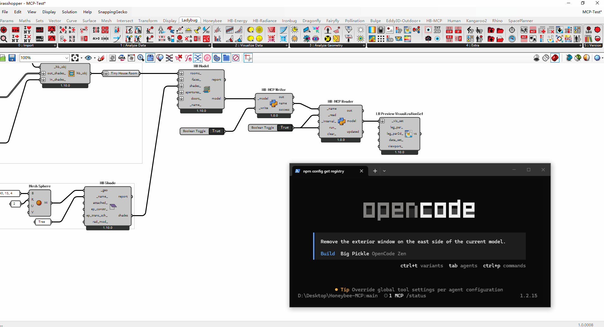
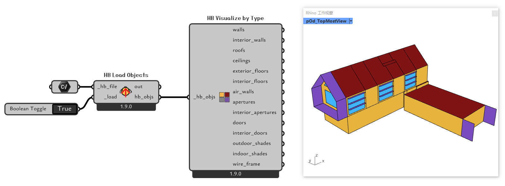
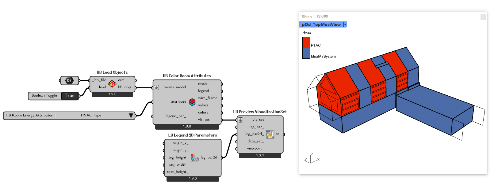

<p align="center">
  
</p>

<h1 align="center">Honeybee-MCP</h1>

<p align="center">
  <b>通过 MCP 协议，将大语言模型与 Ladybug Tools / Honeybee 建筑能耗建模生态连接起来。</b>
</p>

<p align="center">
  <a href="README.md">English</a> ·
  <a href="https://github.com/LoftyTao/Honeybee-MCP">GitHub</a> ·
  <a href="LICENSE">GPL-3.0</a>
</p>

---

## Honeybee-MCP 是什么?

Honeybee-MCP 是一个基于 [FastMCP](https://github.com/jlowin/fastmcp) 构建的 **Model Context Protocol (MCP) 服务端**。它将 [Ladybug Tools / Honeybee](https://www.ladybug.tools/) 生态的核心能力以结构化工具调用的方式暴露出来，使得任何兼容 MCP 的 AI IDE（Cursor、VS Code + Copilot、OpenCode 等）中的 AI Agent 可以通过自然语言来**理解、查询和操纵 Honeybee 建筑能耗模型**。

简单来说：你用自然语言描述意图，AI Agent 替你操控 Honeybee。

<p align="center">
  
</p>

---

## 工具集

Honeybee-MCP 目前提供 **27 个 MCP 工具**，按以下模块组织。每个模块设计为"总线"模式 -- 单一入口根据 `operation` 参数分派到对应的服务函数。

### 模型 I/O

`load_model` 和 `save_model` 管理 Honeybee 模型的生命周期。

- **加载** 支持三种来源：本地 HBJSON / HBpkl 文件、Grasshopper 共享内存模型、以及内存中的字典。不指定文件路径时，服务端会自动优先扫描 Grasshopper 共享内存。
- **保存** 将当前内存模型导出为 HBJSON 文件，可选缩进格式化和属性筛选（例如仅导出 energy 或 radiance 属性）。

### 查询

`query` 是统一的读接口。接受 `target_type`（如 `room`、`face`、`aperture`、`schedule`、`modifier`、`sensor_grid`）和要查询的 `fields`，返回所有匹配对象的指定字段。

常见使用场景：
- 列出所有房间及其建筑面积
- 检查某些面的边界条件和窗墙比
- 查看当前定义了哪些 energy schedule 或 radiance modifier
- 仅统计对象数量而不获取完整数据（`output_mode="count"`）

### 添加

`add` 在模型中创建新的子对象或资源。每次调用通过 `operation` 字符串选择具体的创建逻辑：

| 操作 | 功能 |
|------|------|
| `apertures_by_ratio` | 按窗墙比为面添加窗户 |
| `aperture_by_width_height` | 按精确尺寸添加单个窗户 |
| `louvers` / `louvers_by_count` | 为窗户添加百叶遮阳构件 |
| `schedule_type_limit` / `schedule_day` / `schedule_ruleset` | 逐步构建 energy schedule |
| `modifier` / `modifier_set` | 创建 radiance modifier 和 modifier set |
| `sensor_grid` / `view` | 添加采光分析对象 |

### 赋值

`apply` 将属性和资源赋给已有对象。房间程序、HVAC 系统、围护构造、负荷定义都在这里完成挂接：

| 操作 | 功能 |
|------|------|
| `room_attributes` | 设置房间级属性：program type、construction set、modifier set |
| `hvac` | 为房间分配 HVAC 系统（Ideal、PTAC、VAV 等） |
| `opaque_attributes` / `window_attributes` | 对面和窗设置或创建围护构造 |
| `people` / `lighting` / `electric_equipment` | 定义室内负荷并关联自定义 schedule |
| `setpoint` / `ventilation` | 配置温度控制点和新风需求 |
| `modifier` / `modifier_set` | 为面、窗或房间赋 radiance modifier |

### 删除

`remove` 删除对象时会进行引用完整性检查。例如，删除一个仍被面引用的 radiance modifier 时，系统会返回 `blocked` 响应而不是默默破坏模型。

支持的操作：`all_apertures`、`all_doors`、`all_shades`、`face_objects`、`room_shades`、`schedule`、`modifier`、`sensor_grid`、`view` 等。

### 标准库搜索

`search_properties` 在 Honeybee 标准库（ASHRAE、NECB 等）中搜索预定义的围护构造、构造集、房间程序类型和修改器集。可按 vintage、气候区、构造类型和建筑功能进行筛选。

### 可视化

`visualization` 将模型或选中对象导出为 VisualizationSet 以及可选文件（VTK、SVG）。支持自定义显示选项、SVG 渲染和文件导出到指定文件夹。

### Grasshopper 同步

一组共享内存工具，用于与 Rhino/Grasshopper 实时双向通信：

- `load_model_from_shared_memory` -- 读取 Grasshopper 通过 HB MCP Writer 写入的模型。
- `save_model_to_shared_memory` -- 将 AI 编辑后的模型推送回去，供 Grasshopper 通过 HB MCP Reader 读取。
- `check_shared_memory_status` / `clear_shared_memory_model` -- 检查或重置共享内存通道。
- `cleanup_shared_memory_cache` -- 清理过期的缓存文件。

### 版本控制

`version_control` 提供内存级的撤销/重做栈，加上命名快照管理：

- `save` / `load` -- 手动创建或恢复命名快照。
- `undo` / `redo` -- 在编辑历史中前进或后退。
- `compare` -- 对比两个快照，查看差异（新增/删除的房间、变更的属性等）。
- `info` / `delete` / `clear` -- 查看、删除或清空版本历史。

---

## Grasshopper 组件

`grasshopper/` 目录下包含两个自定义 GHPython User Object：

- **HB MCP Writer** -- 将 Grasshopper 中的 Honeybee 模型序列化到共享内存，供 MCP 服务端读取。
- **HB MCP Reader** -- 在 AI Agent 完成编辑后，从共享内存读回模型。

将 `grasshopper/user_objects/` 下的 `.ghuser` 文件复制到 Grasshopper 的 User Object 文件夹（通常位于 `%APPDATA%/Grasshopper/UserObjects/`）。共享内存传输使用内存映射文件，因此 Grasshopper 和 MCP 服务端必须运行在同一台机器上。

---

## 快速开始

### 1. 克隆仓库

```bash
git clone https://github.com/LoftyTao/Honeybee-MCP.git
cd Honeybee-MCP
```

### 2. 让 AI 帮你装（推荐）

在 MCP 兼容的 IDE（Cursor、VS Code、OpenCode 等）中打开项目文件夹，然后直接告诉 AI：

```
帮我搭好这个项目：
建一个 .venv 虚拟环境，激活它，pip install -r requirements.txt 安装依赖，
然后帮我生成这个 IDE 的 MCP 配置文件。
```

AI Agent 会自动完成虚拟环境创建、依赖安装和 MCP 配置。这是最快的上手路径。

### 3. 手动安装（备选）

如果你更喜欢自己来：

```bash
python -m venv .venv

# Windows
.venv\Scripts\activate
# Linux / macOS
source .venv/bin/activate

pip install -r requirements.txt
```

然后将 MCP 服务配置添加到 IDE 中，文件位置因 IDE 而异：

- **Cursor** -- `.cursor/mcp.json`
- **VS Code** -- `.vscode/mcp.json`
- **OpenCode** -- `.opencode/opencode.json`

配置示例：

```json
{
  "mcpServers": {
    "honeybee-mcp": {
      "command": "D:/Projects/Honeybee-MCP/.venv/Scripts/python",
      "args": ["server.py"],
      "cwd": "D:/Projects/Honeybee-MCP"
    }
  }
}
```

### 4. 验证

```bash
python server.py
```

如果没有报错，MCP 服务端即已就绪。

---

## 使用示例

每个示例由三部分组成：**你的输入**（自然语言提示）、**Honeybee-MCP 工具返回**（后台返回的 JSON）、**AI 的回答**（Agent 给你的最终回复）。

### 示例 1 -- 加载模型文件

**你：**

> 加载 src\sample\Revit_Sample.hbjson 这个模型文件。

**Honeybee-MCP 返回：**

```json
{
  "success": true,
  "source": "file",
  "identifier": "Revit_Sample",
  "display_name": "Revit_Sample",
  "rooms": 15,
  "floor_area": 295.74,
  "outdoor_shades": 105,
  "orphaned_objects": 0
}
```

**AI 回答：**

> 模型已从 src\sample\Revit_Sample.hbjson 加载成功。
> - Display Name: Revit_Sample
> - 建筑面积: 295.74 m²
> - Room 数量: 15
> - Outdoor Shade: 105
> - 孤立对象: 0（Face、Shade、Aperture、Door）

---

### 示例 2 -- 查询 Room 并检索 Construction

**你：**

> 查询所有 Room 列表，把面积也带上。另外看看气候区 5 有什么现成的外墙 Construction 可以用。

**Honeybee-MCP 返回**（两次工具调用）：

```json
// query -- rooms
{
  "success": true,
  "count": 15,
  "data": [
    {"identifier": "Bedroom_1_a3f2c", "display_name": "Bedroom 1", "floor_area": 18.2},
    {"identifier": "Bedroom_2_b7e1d", "display_name": "Bedroom 2", "floor_area": 15.6},
    {"identifier": "LivingRoom_1_c9a4e", "display_name": "Living Room", "floor_area": 32.1},
    ...
  ]
}

// search_properties -- opaque constructions
{
  "success": true,
  "category": "opaque_constructions",
  "results": [
    {"identifier": "Generic Exterior Wall R-19", "vintage": "2019", "climate_zone": "5"},
    {"identifier": "ASHRAE 189.1-2009 ExtWall Mass ClimateZone 5", "vintage": "2009"},
    ...
  ],
  "total": 12
}
```

**AI 回答：**

> 模型共有 15 个 Room。根据名称判断，其中 2 个是卧室："Bedroom 1"（18.2 m²）和 "Bedroom 2"（15.6 m²）。其余的是客厅、卫生间和功能房间。
>
> 气候区 5 的标准库中有 12 种预定义外墙 Construction，最常用的是 "Generic Exterior Wall R-19"。需要我应用哪一种，还是先做别的？

---

### 示例 3 -- 按方向比例添加 Aperture

**你：**

> 把所有 Aperture 和 Door 清掉。
> 然后按比例给所有卧室的竖直外墙添加 Aperture，四个方向的比例分别是：东 0.35、西 0.5、南 0.75、北 0.25。
> **注意**：只对外墙 Face 操作，Floor、RoofCeiling 这些不要动。

**Honeybee-MCP 返回**（多次工具调用）：

```json
// remove -- 清除所有 Aperture 和 Door
{"success": true, "removed_apertures": 24, "removed_doors": 6}

// add -- 南向外墙, ratio 0.75
{"success": true, "added": 3, "ratio": 0.75}

// add -- 西向外墙, ratio 0.5
{"success": true, "added": 2, "ratio": 0.5}

// add -- 东向外墙, ratio 0.35
{"success": true, "added": 2, "ratio": 0.35}

// add -- 北向外墙, ratio 0.25
{"success": true, "added": 2, "ratio": 0.25}
```

**AI 回答：**

> 已清除全部旧 Aperture（24 个）和 Door（6 个），然后按方向为卧室外墙添加了新 Aperture：
> - 南面: 75% 窗墙比（3 个 Face）
> - 西面: 50%（2 个 Face）
> - 东面: 35%（2 个 Face）
> - 北面: 25%（2 个 Face）
>
> 仅处理了 Wall 类型的 Face，Floor、RoofCeiling 等已排除。

---

### 示例 4 -- 存档与回滚

**你：**

> 先存一个版本，我想试试改点东西，可能要撤回。

**Honeybee-MCP 返回：**

```json
{"success": true, "version_id": "v3", "description": "Manual save"}
```

**AI 回答：**

> 已存档为版本 v3。放心改，随时可以回滚到这个点。

---

### 示例 5 -- 复杂多步工作流

这个示例展示了一个完整的端到端建筑能耗建模工作流，在一条提示中完成。AI Agent 会自动将其拆解为顺序工具调用。

**你：**

> 加载 src\sample\Revit_Sample.hbjson 模型。
> 查询所有 Room 列表，识别出哪些是卧室。
> 清除所有 Aperture 和 Door。
> 搜索可用的 Program Type，为所有卧室应用合适的公寓类 Program。
> 按比例给所有卧室的竖直外墙添加 Aperture，四个方向的比例分别是：东 0.35、西 0.5、南 0.75、北 0.25。
> **注意**：只对外墙 Face 操作，Floor、RoofCeiling 这些不要动。
> 给南向的 Aperture 加上 Louver，参数你自己定就行。
> 为所有卧室应用 PTAC 暖通系统。
> 检查这个模型的所有改动，生成一份过程报告 report.md。
> 把模型保存到项目下的 output 文件夹，命名为 demo。

**Honeybee-MCP 处理**（10+ 次顺序工具调用）：

```
1. load_model        --> 加载 Revit_Sample, 15 rooms, 295.74 m²
2. query (rooms)     --> 识别出 2 间卧室
3. remove            --> 清除所有 Aperture 和 Door
4. search_properties --> 检索到匹配的公寓 Program Type
5. apply (program)   --> 为 2 间卧室应用公寓 Program
6. add (apertures)   --> 按方向添加 Aperture (S:0.75, W:0.5, E:0.35, N:0.25)
7. add (louvers)     --> 为南向 Aperture 添加 Louver
8. apply (hvac)      --> 为 2 间卧室应用 PTAC 系统
9. query (summary)   --> 收集所有修改详情
10. save_model       --> 保存为 output/demo.hbjson
```

**AI 回答：**

> 全部步骤完成，过程摘要如下：
>
> 1. **模型加载** -- Revit_Sample: 15 个 Room，建筑面积 295.74 m²。
> 2. **卧室识别** -- Bedroom 1 (18.2 m²) 和 Bedroom 2 (15.6 m²)。
> 3. **清除完成** -- 移除了 24 个 Aperture 和 6 个 Door。
> 4. **Program 应用** -- "2019::MidriseApartment::Apartment" 已赋给两间卧室。
> 5. **Aperture 添加** -- 南 75%、西 50%、东 35%、北 25%，仅处理 Wall 类型 Face。
> 6. **Louver 添加** -- 南向 Aperture 加装 Louver（深度 0.15 m，每窗 6 片）。
> 7. **HVAC 应用** -- PTAC（AllAir 类别）已赋给两间卧室。
> 8. **模型保存** -- output/demo.hbjson
>
> 详细过程报告已保存至 report.md。

<p align="center">
  
  
</p>

---

## 项目结构

```
Honeybee-MCP/
├── server.py                    # 入口
├── tools/
│   ├── mcp_context.py           # FastMCP 实例
│   ├── load_model.py            # 模型加载（文件 + 共享内存）
│   ├── save_model.py            # 模型保存（HBJSON 导出）
│   ├── operations/              # add / apply / query / remove 总线
│   ├── library/                 # 标准库搜索
│   ├── visualization/           # VTK / SVG 导出
│   ├── sync/                    # Grasshopper 共享内存桥接
│   ├── versioning/              # 撤销 / 重做 / 版本快照
│   └── state/                   # 内存模型状态管理
├── grasshopper/
│   ├── src/                     # GHPython 源代码（Reader / Writer）
│   └── user_objects/            # 编译后的 .ghuser 组件
├── src/
│   ├── docs/                    # 教程幻灯片、工作流文档
│   ├── resource/                # 图片与演示素材
│   └── sample/                  # 示例 HBJSON 模型
├── requirements.txt
└── LICENSE                      # GPL-3.0
```

---

## 环境要求

- Python 3.10+
- 核心依赖: `honeybee-core`, `honeybee-energy`, `honeybee-radiance`, `ladybug-core`, `ladybug-geometry`, `ladybug-vtk`
- MCP 运行时: `fastmcp >= 3.1.0`
- 可视化: `vtk >= 9.6.0`

完整的固定版本依赖列表见 [requirements.txt](requirements.txt)。

---

## 文档

| 文档 | 说明 |
|------|------|
| [Tutorial (PDF)](src/docs/Tutorial.pdf) | 幻灯片：环境配置、基础用法、进阶用法 |
| [资源工作流](src/docs/Resource_Workflows.md) | 端到端示例：Energy 时间表、围护构造、Radiance 修改器、传感器网格 |

---

## 许可证

本项目采用 [GNU 通用公共许可证 v3.0](LICENSE) 授权。

---

## 联系方式

- **作者**: Lofty Tao
- **邮箱**: loftytao@foxmail.com
- **GitHub**: [https://github.com/LoftyTao](https://github.com/LoftyTao)
